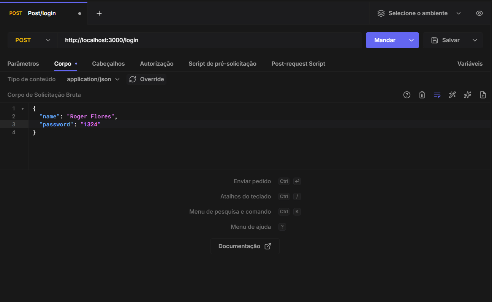
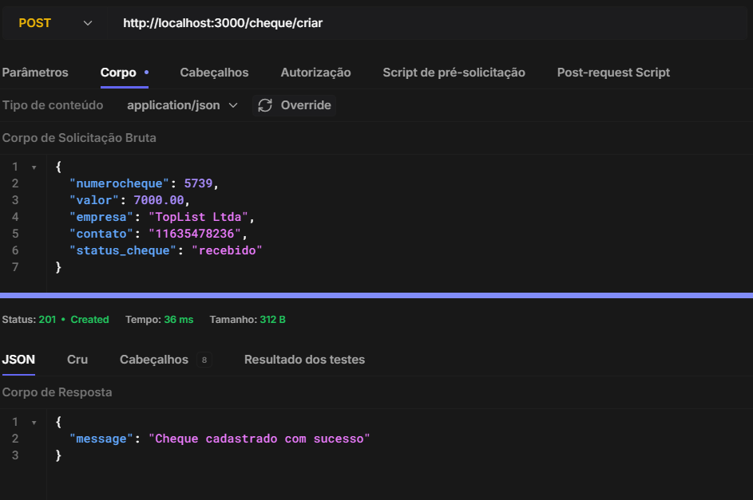
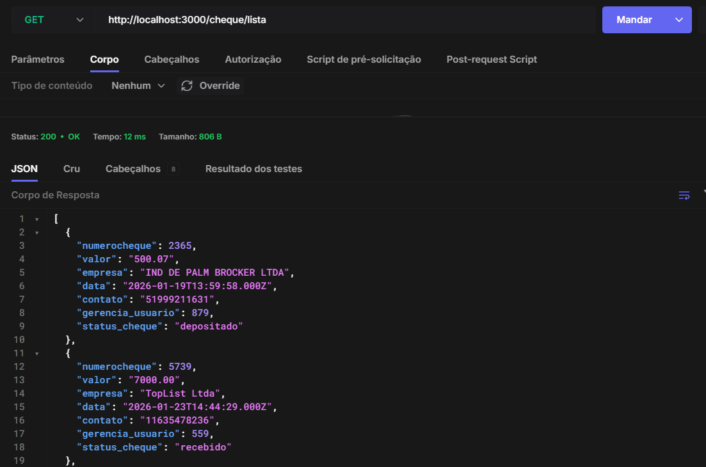
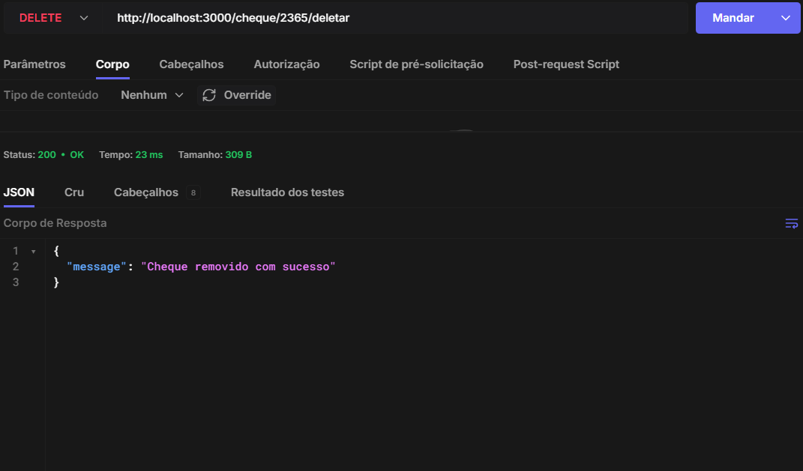

# 🧾 Projeto Cheque API

API REST desenvolvida para controle e gerenciamento de cheques recebidos por um mercado.

---

## 🚀 Tecnologias utilizadas
- Node.js
- Express
- MySQL
- JWT (JSON Web Token)
- bcrypt
- Nodemon

---

## 📌 Funcionalidades

### 🔐 Autenticação
- Login com JWT
- Proteção de rotas com middleware

### 👤 Usuários
- Cadastro de usuários (somente gerente)
- Atualização de usuário (gerente)
- Exclusão de usuário (gerente)
- Controle de status (ativo/inativo)
- Controle de tipo (gerente / usuário)

### 💳 Cheques
- Criar cheque
- Listar cheques
- Editar cheque (gerente)
- Atualizar status do cheque (regras de transição)
- Deletar cheque (gerente)

---

## 🔄 Regras de negócio
- Usuários visualizam **todos os cheques**
- Gerente possui controle total
- Fluxo de status do cheque:
  - recebido → guardado → depositado

---

## 🧱 Arquitetura
O projeto segue o padrão:
- **Routes** → definição das rotas
- **Controllers** → tratamento das requisições
- **Services** → regras de negócio
- **Middlewares** → autenticação e autorização

---

## 🧪 Exemplos de uso (Hoppscotch)

### 🔐 Login
```http
POST /login




### 💳 Criar cheque
POST /cheque/criar




### 📋 Listar cheques
GET /cheque/listar




### 🗑️ Deletar cheque
DELETE /cheque/deletar



```


## ▶️ Como executar o projeto

1. Clone o repositório
```bash
git clone https://github.com/seu-usuario/projeto-cheque

2. Instale as dependências do projeto
npm install

3. Configure seu .env
JWT_KEY=sua_chave_secreta
DB_HOST=localhost
DB_USER=root
DB_PASSWORD=senha
DB_NAME=projetoCheque

4. Comando para executar o projeto
npm run dev


## ✍️ Autor

Daniel Scheffel de Oliveira